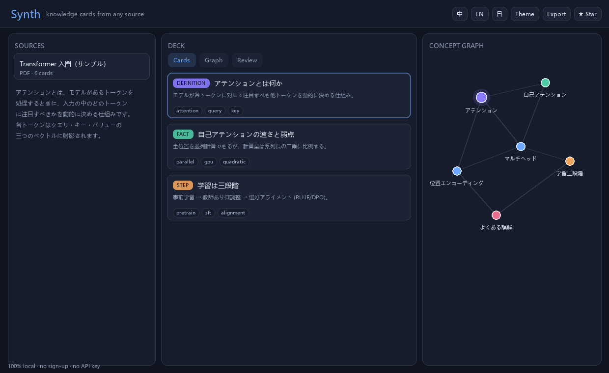

<div align="center">

# Synth

**把任何 PDF、文章或笔记，变成一叠能浏览、能追问、能复习的知识卡。**

100% 本地运行 · 无需注册 · 无需 API Key · MIT 开源

[](https://github.com/zhangxuhan/synth/actions)
[](LICENSE)
[](#参与贡献)
[](https://github.com/zhangxuhan/synth)

[English](README.md) · **简体中文** · [日本語](README.ja.md)



</div>

---

## 为什么还要再做一个学习工具

「和 PDF 聊天」给你的是一段聊天记录。关掉标签页，什么都没留下。

Synth 是**卡组优先**，不是聊天优先。资料会变成一组结构化卡片，你可以快速浏览、建立关联、
反复提问，并且**真的记住它**。聊天只是右边的侧栏。

|                      | Chat-with-PDF 类工具 | Anki | **Synth** |
| -------------------- | :------------------: | :--: | :-------: |
| 结构化卡片           |          –           | ✅ 手写 | ✅ 自动 |
| 概念图谱             |          –           |  –   |    ✅     |
| 间隔重复复习         |          –           |  ✅  |    ✅     |
| 带引用的问答         |          ✅          |  –   |    ✅     |
| 不需要 API Key       |          –           |  ✅  |    ✅     |
| 数据不出本机         |          –           |  ✅  |    ✅     |

## 功能

- **拖进来就行** —— PDF、TXT、Markdown、纯文本或网页链接，拖到窗口任意位置即可。
- **流式成卡** —— 卡片一张张出现，含类型、摘要、要点、标签，并保留回到原文的精确定位。
- **概念图谱** —— 卡片之间按标签关联，力导向图可拖拽、可点击跳转。
- **间隔重复** —— SM-2 调度器，四档评分、间隔预览、键盘快捷键。
- **有据可查的问答** —— 在你自己的卡组上做 BM25 检索，每个回答都标注引用了哪几张卡。
- **导出到任何地方** —— Markdown / Obsidian、Anki 可导入的 TSV、JSON 备份，或把单张卡片存成分享用的 PNG。
- **三语界面** —— 中文 / English / 日本語，随时切换。
- **零配置** —— 默认的抽取器完全离线且结果确定。只有想要更高质量时，才需要打开 Ollama。
- **数据不出本机** —— 没有后端，没有埋点，全部存在浏览器 `localStorage` 里。

## 快速开始

```bash
git clone https://github.com/zhangxuhan/synth.git
cd synth
npm install
npm run dev
```

打开 http://localhost:5173 ，点「一键体验示例」。上手流程就这一步。

`npm run build` 产出的 `dist/` 是纯静态站点，可以直接部署到 GitHub Pages、Netlify 或 Cloudflare Pages。

### 可选：用本地大模型提升卡片质量

不装任何模型也能用。想要更精细的卡片，就跑一个 [Ollama](https://ollama.com)：

```bash
ollama pull qwen2.5:7b
OLLAMA_ORIGINS='*' ollama serve
```

然后在顶栏打开「本地模型」。如果连不上 Ollama，Synth 会自动退回离线抽取器，不会卡死在半路。

## 快捷键

| 按键              | 作用                     |
| ----------------- | ------------------------ |
| `空格`            | 复习模式下显示答案       |
| `1` `2` `3` `4`   | 重来 / 困难 / 一般 / 简单 |
| `Ctrl/⌘ + Enter`  | 从粘贴的文本生成卡片     |

## 工作原理

```
原文 ──► 规范化 ──► 按标题分块 ──► TF-IDF 排序 ──► 知识卡
                                        │
                    标签重叠 ────────────┼──► 概念图谱
                    SM-2 调度 ───────────┼──► 复习队列
                    BM25 检索 ───────────┴──► 带引用的问答
```

离线管线是确定性的、无外部依赖的：按标题切块 → TF-IDF 给句子打分 → 选出摘要句和支撑要点 →
提取标签 → 标签重叠的卡片互相连边。不用嵌入模型，不联网，不等待。

## 技术栈

React 18 · TypeScript · Vite · pdf.js —— 就这些。三个运行时依赖，应用包体约 50 KB（gzip），
pdf.js 只在你真的导入 PDF 时才按需加载。

```
src/
  lib/        text.ts · generator.ts · search.ts · srs.ts · importers.ts · exporters.ts · store.ts
  components/ TopBar · Landing · SourcePane · DeckPane · CardItem · GraphView · ReviewPane · ChatPane
```

## 路线图

- [ ] 用本地 Whisper 支持 YouTube / 音频转写
- [ ] 挖空（Cloze）卡片
- [ ] 带媒体的真正 `.apkg` 导出
- [ ] Tauri 桌面版（双击安装即用）
- [ ] 跨全部资料的统一图谱

## 参与贡献

欢迎提 Issue 和 PR，尤其是导入器、语言包和卡片质量启发式。

```bash
npm run check   # 类型检查 + 冒烟测试 + 构建
```

## 许可证

MIT © contributors

<div align="center">

如果 Synth 帮你省下了一个小时，点个 ⭐ 能让更多人找到它。

</div>
